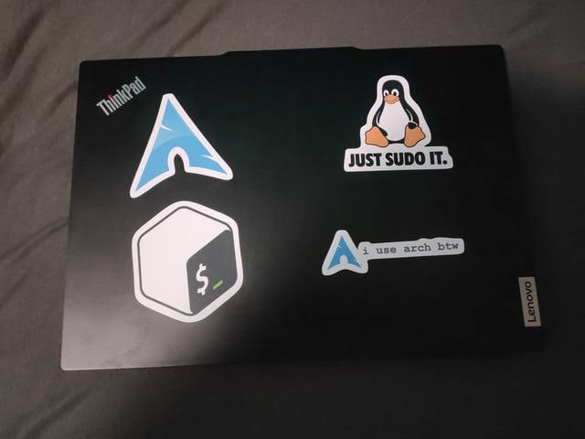

# PC DA XUXA

Esse repositório é inspirado pelo [pc-carroca](https://github.com/terremoth/pc).

Você tem um PC da Xuxa? (aquele típico computador com hardware limitado)?  
Não tem problema, é possível fazê-lo utilizável.

Tive várias experiências com Windows, usei desde o XP até o 11, em todos eles estudei formas de otimização para melhorar o uso de CPU, RAM, etc.

## Meu Notebook de Testes

<table>
  <tr>
    <td>Notebook RV415</td>
  </tr>
  <tr>
    <td>CPU AMD E-300</td>
  </tr>
  <tr>
    <td>Sem placa de vídeo</td>
  </tr>
  <tr>
    <td>2GB de RAM</td>
  </tr>
  <tr>
    <td>HD 5400rpm todo destruído</td>
  </tr>
</table>

Esse foi meu notebook que usei por anos e fiz tantos testes de performance.  
Com certeza, com o sistema e otimização adequado, você consegue um desempenho ótimo no dia a dia.

---

## Coloque um Sistema Operacional que Preste

**Linux.** Windows não é opção para PC fraco, apenas para medianos ou acima (e mesmo assim, não recomendo).

"Ah, mas eu não quero fazer 213414 comandos para criar uma pasta..."  
– Literalmente, em qualquer explorador de arquivos do Linux é um botão para criar uma pasta, no terminal é apenas uma linha com 3 palavras.

"Mas eu quero usar pra jogar"  
– A maioria dos jogos que você abrir, vai funcionar no Linux via Wine ou Proton.  
Quer saber se seu jogo da Steam é compatível?  
👉 [ProtonDB](https://www.protondb.com/)

---

## "Ah, mas e o FPS?"

É comprovado que Linux tem melhor FPS que Windows em vários jogos se instalado devidamente:  
👉 [Flow Games - Teste Linux vs Windows](https://flowgames.gg/steamos-detona-windows-11-todos-testes-pcs-portateis/)

Nem todos os jogos são melhores no Linux, principalmente para rodarem jogos exclusivos de Windows, pois precisam traduzir a linguagem do Windows para si.  
Porém, com experiência minha e de outras pessoas que testaram jogos como **Osu!, Minecraft, Roblox, GTA V, Cyberpunk 2077**, entre outros, os resultados foram:

- FPS maiores em vários jogos
- Diminuição do input lag
- Exemplo: no **Minecraft Java**, o FPS dobrou (de 120–200 para 300–400, às vezes 600–800)  
- No **Osu!**, o input lag diminuiu muito  
- Em outros jogos, o desempenho não foi tão bom

---

## A única opção que você tem

**A única opção que você tem** em minha visão para continuar no Linux é realmente precisar de algum aplicativo ou jogo que **não é compatível** de jeito nenhum com o Windows.  
Exemplos:  
- Pacote Adobe (há alternativas no Linux)  
- Jogos como **Valorant**, **Apex Legends**, etc.  

---

## Sistemas Operacionais que Recomendo

**Não recomendo interfaces parecidas com Windows** se você quer se aprofundar no Linux.  
Mas, caso queira uma curva de aprendizado suave, pode ser uma boa opção, apenas não ache que irá funcionar como Windows.

### Para iniciantes:

- [Zorin OS](https://zorin.com/os/download/)  
  -> Experiência de usuário ótima, pode se moldar ao design parecido ao Windows, macOS, entre outras opções.

- [Linux Mint](https://linuxmint.com/)  
  -> Não atualiza frequentemente, mas é o queridinho da comunidade, além de parecer com o design do Windows 10.

- [Fedora](https://www.fedoraproject.org/)  
  -> Atualização frequente e rápida, super estável.
